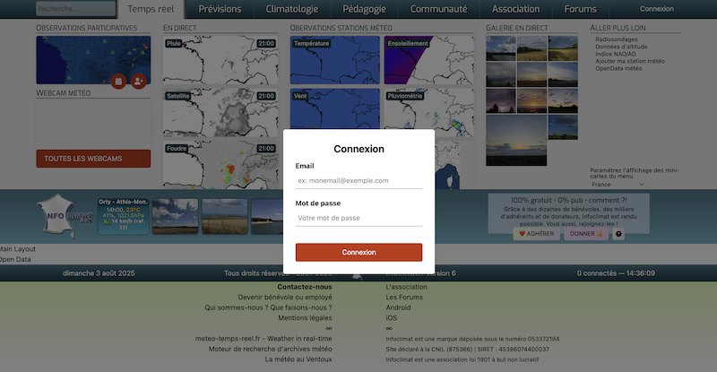
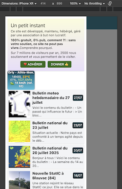

## Preview

We try to reproduce existing app of [infoclimat.fr](https://infoclimat.fr) in Vue3 + Nestjs backend.

In production, URLs are routing to PHP files that embed the Vue app (see **How It Works**).

Desktop version:



Responsive version:



## How It Works

> ℹ️ In dev, it's just a simple Vue app under :5173 (see **Develop** section). But in production, as we don't want to create a SPA (for SEO reason), neither a Nuxt/node server (so we can inject the front app in the existing PHP project), we build this project so it can be injected in PHP classic endpoints.

We use PHP to handle nginx requests (`nginx -> PHP`) to host the Vue3 app as a simple PHP/HTML/JS app.
We chose this approach instead of server-side rendering in Node.js (or Nuxt) to avoid unnecessary complexity. We also didn't want a static Single Page Application (SPA) as it would lose SEO capabilities.

So, we create a Vue3 app that is embedded by PHP as a simple HTML output (`<div id="app"></div>`) inside a `<?php ... ?>` file.

This is how it works:

- We build the Vue3 app as a set of dist files (static bundle files). We develop it as a classic Vue app with `npm run dev`.
- After the build, PHP can access the dist files since they are static files deployed somewhere (S3 object storage, or rsync to a directory of the PHP instance)
- The PHP files (which render the frontend) return the HTML to embed the Vue3 app (using `VueAssetLoader.php`) in a `<div id="app"></div>` + `<script src="..."></script>` (see `php-app-example/index.php`).
- The Vue3 app has a router with routes matching those from which PHP returns the Vue3 HTML app. For example, if the PHP URLs where we want the Vue3 app are `/some/route` and `/something/else/whatever`, we ensure the app router has these same routes.

➡️ **This way, we just have PHP pages (served by nginx, using whatever URLs we want for the SEO) that render our Vue app pages.**

## Prerequisites

The Vue3 app needs the new nestjs backend in **infoclimat-v6-backend** which is running by default in `http://localhost:3000/api` (see `common.api.ts`)

## Develop

1. Ensure the **infoclimat-v6-backend** backend is running (see above)
2. Start the Vue3 app:

```bash
cd vue-app
nvm use
npm ci
# Dev
npm run dev
```

⚠️ Check that the page that exist. For example /opendata exists (see `vue-app/src/router/index`):
➡️ http://localhost:5173/opendata

## Production release: Try it as in production

```bash
# Build the vue3 app, with its manifest so PHP can embed it:
cd vue-app

nvm use
npm ci

npm run build

# Emulate the Nginx/PHP environment that embed the Vue3 app:
cd -
docker compose up
```

Then, reach :

- http://localhost:8080/opendata (some router endpoint)
